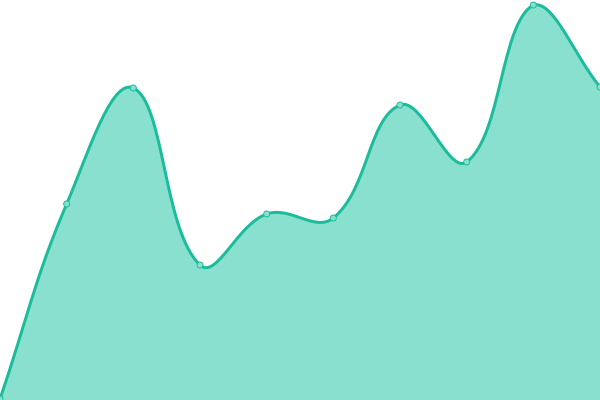
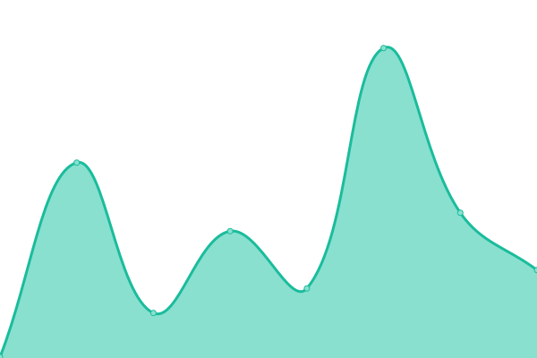

# [📈 Live Status](https://status.willhackett.com): <!--live status--> **🟧 Partial outage**

This repository contains the open-source uptime monitor and status page for [Will Hackett](https://www.willhackett.com/), powered by [Upptime](https://github.com/upptime/upptime).

With [Upptime](https://upptime.js.org), you can get your own unlimited and free uptime monitor and status page, powered entirely by a GitHub repository. We use [Issues](https://github.com/willhackett/status/issues) as incident reports, [Actions](https://github.com/willhackett/status/actions) as uptime monitors, and [Pages](https://status.willhackett.com) for the status page.

<!--start: status pages-->
<!-- This summary is generated by Upptime (https://github.com/upptime/upptime) -->
<!-- Do not edit this manually, your changes will be overwritten -->
<!-- prettier-ignore -->
| URL | Status | History | Response Time | Uptime |
| --- | ------ | ------- | ------------- | ------ |
|  [MTA STS](https://mta-sts.willhackett.com/.well-known/mta-sts.txt) | 🟥 Down | [mta-sts.yml](https://github.com/willhackett/status/commits/HEAD/history/mta-sts.yml) | 

 314ms
     
 | 

<a href="https://status.willhackett.com/history/mta-sts">100.00%</a>
    

|  [Stats](https://digistats.ch) | 🟩 Up | [stats.yml](https://github.com/willhackett/status/commits/HEAD/history/stats.yml) | 

 903ms
     
 | 

<a href="https://status.willhackett.com/history/stats">99.74%</a>
    

|  [Mail](https://fastmailstatus.com/summary.json) | 🟩 Up | [mail.yml](https://github.com/willhackett/status/commits/HEAD/history/mail.yml) | 

 248ms
     
 | 

<a href="https://status.willhackett.com/history/mail">100.00%</a>
    

|  [CDN](https://status.bunny.net/index.json) | 🟩 Up | [cdn.yml](https://github.com/willhackett/status/commits/HEAD/history/cdn.yml) | 

 370ms
     
 | 

<a href="https://status.willhackett.com/history/cdn">94.68%</a>
    

|  [DNS](https://dns.google/resolve?name=willhackett.com&type=MX) | 🟩 Up | [dns.yml](https://github.com/willhackett/status/commits/HEAD/history/dns.yml) | 

 84ms
     
 | 

<a href="https://status.willhackett.com/history/dns">100.00%</a>
    

<!--end: status pages-->

[**Visit our status website →**](https://status.willhackett.com)

## 📄 License

- Powered by: [Upptime](https://github.com/upptime/upptime)
- Code: [MIT](./LICENSE) © [Anand Chowdhary](https://anandchowdhary.com), supported by [Pabio](https://pabio.com)
- Data in the `./history` directory: [Open Database License](https://opendatacommons.org/licenses/odbl/1-0/)
